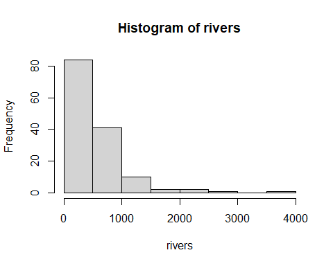

# IST772, Standard Homework Heading

__Student name__:Kyle Walter  
__Homework number__:1  
__Date due__: 2021-04-18

__Attribution statement__:
I did this homework by myself, with help from the book and the professor

***
## Homework 1  
### Exercise 1  
#### Prompt - using material from the chapter and other information you look up, write brief definitions in your words of the following items:  
1. mean - sum of a set of numbers divided by the number of observations in the set.  
2. median - In a set of odd numbers this is the number in the middle of set when arranged in either ascending or descending order. When a set has an even number of observations it is the average of the two numbers in the middle.  
3. standard deviation - a measure of how far from the means an observation in the set lies. Almost all of the day will lie within 3 standard deviations if the observations are normally distributed.  
4. histogram - a graphical representation of a set of a single values. width of the bar will be value range of the observations while height will indicate how many times the observation range is observed in the set.  
5. normal distribution - Observations that follow the normal distribution will form a bell shaped curve when graphed. The mean is at the highest point in the curve and 99.7% of the data will fall within 3 standard deviations of the mean.  
6. Poisson distribution - a discrete distribution that counts how many times an event is observed in a fixed time interval. An example is how many customers is a bank teller likely to serve in an hour.  

### Exercise 3  
#### Prompt - Use the dat function in R and pick a data set from the list, run the summary command and breifly describe what the mean and median represent.  

```r
data(ChickWeight) #calls the data set into the R enviroment
summary(ChickWeight) #summarises the data set variables
```

```
##      weight           Time           Chick     Diet   
##  Min.   : 35.0   Min.   : 0.00   13     : 12   1:220  
##  1st Qu.: 63.0   1st Qu.: 4.00   9      : 12   2:120  
##  Median :103.0   Median :10.00   20     : 12   3:120  
##  Mean   :121.8   Mean   :10.72   10     : 12   4:118  
##  3rd Qu.:163.8   3rd Qu.:16.00   17     : 12          
##  Max.   :373.0   Max.   :21.00   19     : 12          
##                                  (Other):506
```
The chick weight data set maps out the weight of newborn chicks vs the type of diet they're recieving and their age to see which diet helps them develop faster.  

As we can see using the summary function, the average weight of all the chicks in in the data set is 121 grams. The median weight is 103 grams meaning the weight at the middle of the dataset is 103 grams when all the chicks weights are lined up in order from lightest to heaviest.  

The heavier chicks are scewing the the average weight higher than the medium because their total weight is that much more.

The other measurement is the the Time. According the data set notes the time represents the age of the chicks. The mean age is 10.72 days while the median is 10 days. Similar to what was seen in the weights the age of the chicks towards that top are pulling the mean higher while the data overall contains more observations of younger chicks.  

### Excercise 4  
#### Prompt - Use the data() function to find a data set in R that has exactly 1 variable. Create a histogram of that variable and describe that variable and type of distribution you think it might be Poisson or normal and speculate why the data likely fits that distribution.  

```r
data(rivers) #calls the data set into the R environment
hist(rivers) #creates a histogram of the variable
```

<!-- -->

The shape of the distribution in plain English is that that more observations of rivers are seen with length less than 500 and more few rivers are seen with longer length. The shape of the distribution appears to be a Poisson. Which makes sense as the number of rivers in North America is a discrete number, ie one cannot observe half a river, and the rivers with length were observed a fixed point in time.

