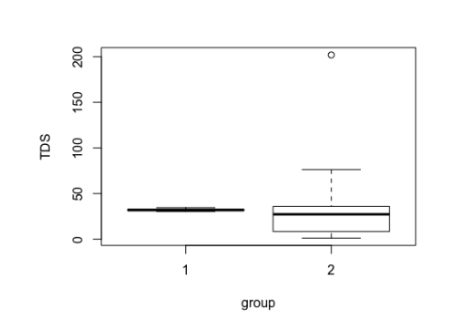

# The Report

The goal of this report is to analyze the statistical output for support that the startup company's new biofilm treatment for water reductes the Total Dissolved Solids(TDS) better than that of the current standard treatment. The start has provided the statistical output of their data for review, however; due to trade constraints has chosen to withhold the larger data set.

Starting by looking at the structure of the data they had for these tests, we see that 32 observations each were taken of the control and sample.
```{r paged.print=TRUE}
dispersion <- data.frame(control=c(30.27,31.25,31.90,32.05,32.81,34.53), Treatment = c(1.78, 8.501, 27.259, 31.079, 35.533, 201.908), row.names = c("Min.", "1st Quantile", "Median","Mean","3rd Quantile","max."))
dispersion
```

Next we looked at the measures of dispersion from the two groups, with the results listed above. The Control group has a quite narrow band of observation ranging from 30.27 on the low end to 34.53 on the high end. The average is 32.05. In contrast the the new treatment designed by the start runs from 1.18 all the way to 201.91 however the average is slightly lower than the control group at 31.079.

The median of the treatment 4 part per million of observed TDS below the average, meaning over half of the data is significantly smaller. However; the maximum observed value is pulling the average higher and definitely leaves some open questions about the quality of the data for the observations.

Next, I looked at the T.Test data provided by the client. the lower bound of the data was -12.35187 and the upper bound is 14.30250. This bound provides a calculated area where we would expect to find the population mean difference between the control and sample. As the bound grows wider, we are less certain of where the population mean lies.

(1)The treatment and sample show a very large range of possible values for the mean difference. The lower bound of the confidence interval is -12.35. While the upper bound is 14.3 More importantly the range passes through zero, raising the possibility that the population mean difference between treatment and control could be zero.

While impossible for us to estimate the mean difference between the two populations, we can however attempt to find an a crude estimate of where it is using the confidence interval by finding the middle of the interval. It is called the Point Estimate of mean difference.

```{r}
PEM <- mean(c(-12.35187,14.30250))
PEM
```
The (2)Point Estimate Mean Difference is .975. This method doesn't prove the population mean, it does help give an idea of where it might be.

Lastly we look at the p-value in the client's T.Test. It shows a value of .88. Meaning we have an 88% chance of observation this variance of means in the wild. Normally a value of .05 or less is what is preferred. This would mean the probability of observing these two means is very small and naturally lend support that treatment has had a statistically significant effect on the population mean.

At this point we've looked at enough information to conclude on the null hypothesis significance test. Out null hypothesis is that the client's new treatment would show no difference or a gain in the amount of TDS in the water. While the the alternative hypothesis is the client's experimental treatment would show a decrease in the TDS Parts Per Million.

(3)Unfortunately, based on the aforementioned high P Value and a confidence interval that passes through zero. We would fail to reject the null hypothesis.

Lastly, as a different test, I looked at the client's High Density Internval output of posterior probabilities.

<center>

</center>
